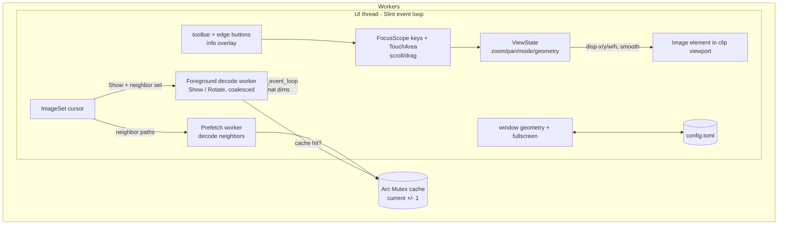

# Plan 2 — Interactive view & chrome

> **For agentic workers:** REQUIRED SUB-SKILL: Use superpowers:subagent-driven-development (recommended) or superpowers:executing-plans to implement this plan task-by-task. Tasks are ordered; each ends in a commit (push after each, per AGENTS.md).

## Context

Plan 1 landed the core viewer foundation: a `photoviewer <path>` binary that pins
the winit+FemtoVG backend, shows the first image fit-to-window (correctly oriented,
fast) via a single **coalescing decode worker** (`app/src/main.rs`), and navigates a
natural-sorted, wrap-around directory set (`imageset`). The image surface is currently
a dumb `Image { width:100%; height:100%; image-fit:contain }` — no zoom, pan, rotate,
or chrome.

This plan implements **build-order steps 2–3** of the Phase-1 design
(`docs/superpowers/specs/2026-05-29-photo-viewer-classic-design.md`): the interactive
view (zoom / pan / view-only rotate / view-mode cycle / fullscreen), neighbor prefetch,
the auto-hiding bottom toolbar + edge buttons, the `I` info overlay, and `config.toml`
window-geometry + fullscreen persistence. Metadata/tags/rating (the `T` editor, EXIF
rotation *persistence*, ratings) remain deferred to Plan 4+; rotation here is **view-only
and resets on navigate**, per the design's "view (zoom/pan/rotation) resets per image"
decision (§2.3).

**Testing approach (revised from Plan 1):** the heavy logic moves into pure crates
(`viewstate`, `config`) with plain unit tests. GUI *wiring* (key→callback, derived
properties, toolbar-button clicks) is tested headlessly with `i-slint-backend-testing`.
Only actual GPU rasterization and cold-start latency stay manual — the renderable
**geometry** (Image x/y/w/h, smooth-vs-pixelated) is asserted numerically, not by pixels.

---

## Architecture



UI element tree (`app/ui/main.slint`):

```
AppWindow (Window)
├─ viewport := Rectangle { clip:true; 100%x100% }   # changed width/height → viewport-changed()
│   ├─ Image { x/y/width/height ← disp-* props; image-rendering ← smooth ? smooth : pixelated }
│   └─ TouchArea { scroll-event → zoom-at; pointer-event/moved → pan-by }
├─ Text status-text (centered)        # existing
├─ Text caption (top-left)            # existing
├─ info-panel := Rectangle            # I overlay; visible: info-visible
├─ left-edge / right-edge buttons     # visible on proximity, fade
└─ toolbar := Rectangle (bottom)      # Prev Next RotL RotR Fullscreen Exit; fade on proximity
```

**New workspace members:** `crates/viewstate`, `crates/config`.
**Workspace deps to add** (`./Cargo.toml [workspace.dependencies]`): `serde = { version="1", features=["derive"] }`, `toml = "0.8"`.
**App deps to add** (`app/Cargo.toml`): `viewstate`, `config` (path deps); dev-dep `i-slint-backend-testing = "1.16"`.

---

## Task 1: `viewstate` crate — pure view-state machine (TDD)

**Files:** create `crates/viewstate/Cargo.toml`, `crates/viewstate/src/lib.rs`; add member to `./Cargo.toml`.

All geometry math lives here so it is unit-testable without Slint. Coordinates are
logical px; pan is an offset added to the centered position.

API:
```rust
pub const ZOOM_STEP: f32 = 1.25;
const MIN_SCALE: f32 = 0.05;
const MAX_SCALE: f32 = 32.0;

#[derive(Clone, Copy, PartialEq, Debug)]
pub enum ViewMode { Fit, OneToOne, Manual }

#[derive(Clone, Copy, PartialEq, Debug)]
pub struct Geometry { pub x: f32, pub y: f32, pub w: f32, pub h: f32, pub smooth: bool }

pub struct ViewState { /* nat_w,nat_h, vp_w,vp_h, mode, manual_scale, last_manual, pan_x,pan_y */ }

impl ViewState {
    pub fn new() -> Self;                       // Fit, no pan
    pub fn set_viewport(&mut self, w: f32, h: f32);
    pub fn load(&mut self, nat_w: f32, nat_h: f32);        // new image: reset Fit, pan 0, last_manual None
    pub fn set_natural(&mut self, nat_w: f32, nat_h: f32); // rotation: keep mode, recenter pan
    pub fn scale(&self) -> f32;                 // Fit→fit_scale, OneToOne→1.0, Manual→manual_scale
    pub fn geometry(&self) -> Geometry;         // centered+pan, clamped; smooth = scale<=1.0
    pub fn zoom(&mut self, factor: f32, anchor_x: f32, anchor_y: f32); // toward anchor → Manual
    pub fn zoom_center(&mut self, factor: f32); // anchor = viewport center (keyboard)
    pub fn pan(&mut self, dx: f32, dy: f32);
    pub fn cycle_mode(&mut self);               // Fit→OneToOne→Manual(last_manual, else Fit)→Fit
    pub fn reset_fit(&mut self);
    pub fn zoom_percent(&self) -> u32;          // (scale*100).round()
}
```

Geometry/zoom math (load-bearing — implement exactly):
```rust
fn fit_scale(&self) -> f32 {
    if self.nat_w<=0.0||self.nat_h<=0.0||self.vp_w<=0.0||self.vp_h<=0.0 { return 1.0; }
    (self.vp_w/self.nat_w).min(self.vp_h/self.nat_h)
}
fn axis(vp: f32, len: f32, pan: f32) -> f32 {
    if len <= vp { (vp - len)/2.0 }                              // smaller than viewport → centered
    else { (((vp - len)/2.0) + pan).clamp(vp - len, 0.0) }       // larger → clamp, no edge gap
}
pub fn geometry(&self) -> Geometry {
    let s = self.scale();
    let (w, h) = (self.nat_w*s, self.nat_h*s);
    Geometry { x: Self::axis(self.vp_w,w,self.pan_x), y: Self::axis(self.vp_h,h,self.pan_y), w, h, smooth: s<=1.0 }
}
pub fn zoom(&mut self, factor: f32, ax: f32, ay: f32) {
    let old = self.scale();
    let new = (old*factor).clamp(MIN_SCALE, MAX_SCALE);
    let g = self.geometry();
    let (ix, iy) = ((ax - g.x)/old, (ay - g.y)/old);            // image point under anchor
    self.mode = ViewMode::Manual; self.manual_scale = new; self.last_manual = Some(new);
    self.pan_x = (ax - ix*new) - (self.vp_w - self.nat_w*new)/2.0; // top-left so anchor stays fixed
    self.pan_y = (ay - iy*new) - (self.vp_h - self.nat_h*new)/2.0;
}
```
`pan()` adds to `pan_x/pan_y` (geometry clamps on read). `cycle_mode`/`load`/`set_viewport`
reset or clamp pan to 0 as noted.

**Tests** (`cargo test -p viewstate`): fit_scale picks the limiting dimension; OneToOne=1.0;
zoom clamps at MIN/MAX; **zoom-toward-anchor invariant** — the image point under the anchor
maps back to the same anchor after zoom; `geometry().x` stays within `[vp-w, 0]` when larger
and equals `(vp-w)/2` when smaller (centered, pan ignored); `cycle_mode` walks Fit→1:1→Manual→Fit
and skips Manual when `last_manual` is None; `zoom_percent` rounds.

Commit: `feat(viewstate): zoom/pan/rotate-agnostic geometry + view-mode state machine`.

---

## Task 2: `config` crate — `$PVC_HOME` + config.toml (TDD)

**Files:** create `crates/config/Cargo.toml` (deps `serde`, `toml`; dev-dep `tempfile`), `crates/config/src/lib.rs`; add member + the `serde`/`toml` workspace deps.

```rust
#[derive(Default, Serialize, Deserialize, Clone, PartialEq, Debug)]
pub struct WindowGeometry { pub x: i32, pub y: i32, pub w: u32, pub h: u32 }

#[derive(Default, Serialize, Deserialize, Clone, PartialEq, Debug)]
pub struct Config { pub geometry: Option<WindowGeometry>, pub fullscreen: bool }

/// $PVC_HOME, else %APPDATA%\PhotoViewerClassic (Windows) / ~/.config/pvc.
/// `get` injects env lookup so this is unit-testable without touching real env.
pub fn config_dir_from(get: impl Fn(&str) -> Option<String>) -> Option<PathBuf>;
pub fn config_dir() -> Option<PathBuf>;                 // wraps config_dir_from(std::env::var ok)
pub fn load() -> Config;                                // missing/corrupt → Config::default()
pub fn save(cfg: &Config) -> std::io::Result<()>;       // mkdir -p dir; write config.toml
```
`config_dir_from`: if `PVC_HOME` set → that; else on `cfg!(windows)` use `APPDATA` joined with
`PhotoViewerClassic`; else `HOME` joined with `.config/pvc`. `load` reads `<dir>/config.toml`,
returns default on any read/parse error (never panics).

**Tests:** `config_dir_from` honors injected `PVC_HOME`, falls back to APPDATA/HOME; serde
round-trip of `Config` with and without geometry; corrupt TOML string → `Config::default()`;
save→load round-trip in a `tempfile::tempdir` via `PVC_HOME`.

Commit: `feat(config): $PVC_HOME resolution + config.toml load/save`.

---

## Task 3: Decode worker — enum jobs, rotation base buffer, neighbor prefetch

**File:** `app/src/main.rs` (rework the worker section; keep `coalesce_latest` + its tests).

Replace `DecodeRequest` with a job enum and add a second, lower-priority prefetch worker
plus a shared decode cache so navigation is instant when prefetched and the UI never blocks.

```rust
enum Job {
    Show { path: PathBuf, caption: Option<String> },
    Rotate(i32),               // +1 = clockwise quarter-turn, -1 = counter-clockwise
}
type Cache = Arc<Mutex<HashMap<PathBuf, Arc<image::RgbaImage>>>>;
```

- **Foreground worker** (`spawn_decode_worker`): keeps `current: Option<(PathBuf, Arc<RgbaImage>)>`
  (the rotation-0 base) and `turns: i32`. Per loop iteration it drains the queue and **reduces**
  the batch: the *last* `Show` wins (coalesce, reuse the existing `coalesce_latest` drain idea);
  any `Rotate`s after it are summed into a net quarter-turn delta. On `Show`: take the buffer from
  the shared `Cache` if present (instant) else `decode::display_image(path, MAX_DISPLAY_DIM)`; set
  it as `current`, reset `turns=0`. On a net rotate: `turns = (turns + delta).rem_euclid(4)` and
  re-derive the displayed buffer from the base with `image::imageops::rotate90/rotate180/rotate270`
  (rotating the cached *base*, not compounding). Push via `upgrade_in_event_loop` the
  `Image::from_rgba8` **plus the resulting nat dims and rotation degrees** (so the UI can call
  `viewstate.load`/`set_natural` and update the info overlay).
- **Prefetch worker** (`spawn_prefetch_worker`): own `mpsc::Sender<Vec<PathBuf>>`. Each message is
  the *keep-set* (current ±1) of paths; decode any missing into `Cache`, drop entries not in the
  set (bounded memory). Decoding here never blocks the foreground worker.
- **Wiring:** `nav_request` (existing) still moves the cursor and builds the caption; after sending
  a `Show`, also send the neighbor keep-set to the prefetch worker (compute peek-ahead/behind paths
  from `ImageSet` — add `ImageSet::peek(offset: isize) -> Option<PathBuf>` to `crates/imageset`,
  a pure index helper with its own unit test, since the cursor itself must not move).

**Tests** (unit, in `main.rs`, no GUI): keep the existing coalesce/serialize tests; add a batch-reduce
test asserting `[Show(a), Rotate(+1), Show(b), Rotate(-1)]` reduces to "show b, net rotate -1"; and
a cache-hit path test (pre-seed the cache, assert no decode call) using a small injected decode fn.

Commit: `feat(app): enum decode jobs, view-only rotation, neighbor prefetch cache`.

---

## Task 4: UI geometry rework + keyboard zoom/pan/view-mode wiring

**Files:** `app/ui/main.slint`, `app/src/main.rs`, `app/Cargo.toml` (add `viewstate` dep + dev-dep `i-slint-backend-testing`).

**Slint** — replace the dumb full-size Image with explicit geometry driven by `in` properties the
app sets from `ViewState::geometry()`, and report viewport resize via a `changed` callback:
```slint
in property <length> disp-x; in property <length> disp-y;
in property <length> disp-w; in property <length> disp-h;
in property <bool> smooth: true;
in property <float> zoom-percent;
callback viewport-changed(length, length);   // (w,h)
callback zoom-by(float, length, length);      // (factor, anchor-x, anchor-y)
callback pan-by(length, length);
callback rotate-cw(); callback rotate-ccw();
callback cycle-view(); callback toggle-fullscreen(); callback toggle-info();

viewport := Rectangle {
    clip: true; width: 100%; height: 100%;
    changed width  => { root.viewport-changed(self.width, self.height); }
    changed height => { root.viewport-changed(self.width, self.height); }
    Image {
        x: root.disp-x; y: root.disp-y; width: root.disp-w; height: root.disp-h;
        source: root.current-image;
        image-rendering: root.smooth ? ImageRendering.smooth : ImageRendering.pixelated;
    }
    ta := TouchArea { /* Task 6 */ }
}
```
Extend the `FocusScope` key handler. Use `event.modifiers.shift` as the discriminator and match
letters case-insensitively (Shift uppercases `event.text`):
- `E` → `rotate-ccw()`, `R` → `rotate-cw()`
- `Z` → `cycle-view()`, `F` → `toggle-fullscreen()`, `I` → `toggle-info()`
- Up/`K`, Down/`J` (no Shift) → `zoom-by(ZOOM_STEP,…)` / `zoom-by(1/ZOOM_STEP,…)` toward center
- Left/`H`, Right/`L` (no Shift) → existing `prev-image()` / `next-image()`
- **Shift** + any of Up/Down/Left/Right/`HJKL` → `pan-by(±step, 0)` / `pan-by(0, ±step)` (step ≈ 80px)
- `Esc` → if `info-visible` close it, else `quit()`; `Q`/`Esc` quit as before.

**main.rs** — hold `ViewState` in a `Rc<RefCell<viewstate::ViewState>>` (UI-thread only, so no Mutex).
Add a helper `apply_geometry(&ui, &vs)` that reads `vs.geometry()` and sets `disp-x/y/w/h`, `smooth`,
`zoom-percent`. Wire each callback to mutate the `ViewState` then call `apply_geometry`:
- `on_viewport_changed` → `vs.set_viewport(w,h)` (convert `length`→f32 via `/1px` already done by
  Slint passing `f32`-coerced lengths; in Rust the args arrive as `f32` logical px)
- `on_zoom_by` → `vs.zoom(factor, ax, ay)`; `on_pan_by` → `vs.pan(dx,dy)`; `on_cycle_view` → `vs.cycle_mode()`
- When a decoded image arrives (Task 3 push closure): call `vs.load(nat_w, nat_h)` for a `Show`, or
  `vs.set_natural(nat_w, nat_h)` for a `Rotate`, then `apply_geometry`.

**Headless GUI tests** (`#[cfg(test)]` in `main.rs`, guarded by `static INIT: Once` calling
`i_slint_backend_testing::init_no_event_loop()` once): construct `AppWindow::new()`, install recording
closures via `on_next_image`/`on_zoom_by`/`on_rotate_cw`/`on_cycle_view`/`on_toggle_fullscreen`, then
simulate keys with the testing keyboard-sequence API and assert the right callback fired with the right
args (e.g. Shift+`L` pans, plain `L` navigates; `Z` cycles). Also set `disp-*` properties and read them
back to confirm the bindings hold.

Commit: `feat(app): explicit zoom/pan geometry + keyboard view controls`.

---

## Task 5: Rotation end-to-end (E / R)

Mostly wired in Tasks 3–4; this task verifies and finishes the loop. `rotate-cw/ccw` callbacks send
`Job::Rotate(±1)` to the foreground worker; the worker re-derives the displayed buffer from the base
and pushes new nat dims + rotation degrees; the UI calls `vs.set_natural(...)` (keeps zoom mode,
recenters) and updates the info overlay's rotation field. Rotation resets to 0 on the next `Show`
(navigation), since the worker resets `turns` and the UI calls `vs.load`. **Manual verify:** open a
landscape photo, `R` rotates 90° CW with the surface re-fitting to the new aspect; navigating away and
back shows it un-rotated.

Commit: `feat(app): view-only 90° rotation via pixel-buffer transform`.

---

## Task 6: Mouse — scroll-zoom-toward-cursor + drag-pan

**File:** `app/ui/main.slint` (the `ta := TouchArea` inside `viewport`).
```slint
ta := TouchArea {
    scroll-event(e) => {
        root.zoom-by(e.delta-y > 0 ? 1.25 : 0.8, self.mouse-x, self.mouse-y);
        return EventResult.accept;
    }
    moved => { root.pan-by(self.mouse-x - root.pan-anchor-x, self.mouse-y - root.pan-anchor-y);
               root.pan-anchor-x = self.mouse-x; root.pan-anchor-y = self.mouse-y; }
    pointer-event(e) => { if (e.kind == PointerEventKind.down) {
               root.pan-anchor-x = self.mouse-x; root.pan-anchor-y = self.mouse-y; } }
}
```
(`pan-anchor-x/y` are private `property <length>`.) Scroll zooms toward the cursor (anchor =
`mouse-x/mouse-y`); left-drag pans. The geometry/clamp correctness is already covered by Task 1's
unit tests — **manual verify** that scroll zooms toward the pointer and drag pans within clamp.

Commit: `feat(app): scroll-to-zoom (toward cursor) and drag-to-pan`.

---

## Task 7: Fullscreen (F) + config.toml geometry/fullscreen persistence

**Files:** `app/src/main.rs`, `app/Cargo.toml` (add `config` dep).

- **Fullscreen:** `toggle-fullscreen` callback flips a UI-thread `Cell<bool>` and calls
  `ui.window().set_fullscreen(new)`. (Verify `set_fullscreen(false)` un-fullscreens on Slint 1.16 —
  historically buggy pre-1.x-fix; if it misbehaves, fall back to the Window `full-screen` in-out
  property toggled in Slint.)
- **Startup restore:** before `ui.run()`, `let cfg = config::load();` — if `cfg.geometry` is set,
  `ui.window().set_position(LogicalPosition)` + `set_size(LogicalSize)`; if `cfg.fullscreen`, set it.
- **Save on exit:** in the `quit` handler, capture `ui.window().position()`, `.size()`, and the
  fullscreen `Cell` into a shared slot, then `quit_event_loop()`. After `ui.run()` returns, build a
  `Config` from the captured slot and `config::save(&cfg)` (ignore errors per the spec's "if
  `$PVC_HOME` not writable → persistence skipped"). Capturing in the quit handler avoids reading a
  destroyed window.

No new automated test (geometry I/O is covered by Task 2; window position round-trip is a manual
check). **Manual verify:** move/resize the window, quit, relaunch → same geometry; toggle `F`, quit,
relaunch → starts fullscreen.

Commit: `feat(app): F fullscreen + persist window geometry & fullscreen to config.toml`.

---

## Task 8: Info overlay (I)

**Files:** `app/ui/main.slint`, `app/src/main.rs`.
Add `in property <bool> info-visible;` and string props `info-name`, `info-path`, `info-dims`,
`info-size`; reuse `zoom-percent` and a `rotation-degrees` prop. The panel is a semi-transparent
top-left `Rectangle` (z above the image, below toolbar) with a `VerticalLayout` of `Text` lines,
`visible: root.info-visible`. The app sets name/path/dims/size when an image is decoded (dims from the
nat buffer, size from `std::fs::metadata(path).len()`), and zoom%/rotation update live from
`apply_geometry` / rotation pushes. `toggle-info` flips `info-visible`. **Phase-1 fields:** filename,
full path, W×H, file size, zoom %, rotation. (Rating/tags are intentionally omitted — they arrive with
the metadata plan; note this in the panel comment.)

**Headless test:** set the info props + `info-visible`, find the panel by element id and assert
`visible`; toggle and re-assert.

Commit: `feat(app): I toggles an info overlay (name/path/dims/size/zoom/rotation)`.

---

## Task 9: Auto-hiding bottom toolbar + edge buttons

**File:** `app/ui/main.slint` (+ small `main.rs` wiring — buttons reuse existing callbacks).
- **Toolbar:** bottom `Rectangle` with a `HorizontalLayout` of buttons — `◀ Prev`, `Next ▶`,
  `↺ Rotate L`, `Rotate R ↻`, `⤢ Fullscreen`, `✕ Exit` — each a `TouchArea`+`Text` (or std `Button`)
  invoking `prev-image` / `next-image` / `rotate-ccw` / `rotate-cw` / `toggle-fullscreen` / `quit`.
- **Edge buttons:** large `‹` / `›` near the left/right edges → `prev-image` / `next-image`.
- **Proximity fade (no polling):** the viewport `TouchArea` exposes `mouse-x/mouse-y` while hovering;
  derive `show-toolbar = ta.has-hover && ta.mouse-y > viewport.height - 80px` (OR `toolbar.has-hover`
  to keep it up while the pointer is on it); edge buttons show analogously near the x-edges. Animate
  `opacity` with `animate opacity { duration: 150ms; }`. This is purely event-driven (hover state),
  satisfying AGENTS.md's no-polling rule — no timers required.

**Headless test:** find each toolbar button by element id / accessible label and `single_click()` it
(async — run under `init_integration_test_with_system_time()` with `slint::spawn_local`), asserting the
matching recorded callback fires. This is the wiring guarantee; the fade itself is a manual check.

Commit: `feat(app): auto-hiding bottom toolbar + edge navigation buttons`.

---

## Task 10: README + full sweep + roadmap note

- Update `README.md` key map (E/R rotate, ↑/K ↓/J zoom, Shift+dirs pan, Z view-mode, F fullscreen,
  I info, scroll/drag mouse) and note config persistence + `$PVC_HOME`.
- `cargo fmt --all` (matches `style: apply cargo fmt` precedent), `cargo clippy --workspace`,
  `cargo test` (viewstate + config + imageset + decode + app unit + app headless GUI), `cargo build`.
- Update the "Next plan" note at the bottom of
  `docs/superpowers/plans/2026-05-29-pvc-core-viewer-foundation.md` to point at Plan 3 (metadata
  engine — JPEG XMP+IPTC tags, rating, EXIF-orientation *persistence*, atomic+verify → Windows gate),
  and add this plan as `docs/superpowers/plans/2026-05-29-pvc-interactive-view-chrome.md`.

Commit: `docs: README controls + Plan 2 doc; chore: fmt/clippy sweep`. Push after each commit
(per AGENTS.md).

---

## Verification (end-to-end)

- `cargo test` — all pure-logic suites pass (`viewstate` geometry/zoom/cycle, `config` round-trip,
  `imageset::peek`), plus the app's headless GUI wiring tests (keys→callbacks, toolbar clicks,
  info-overlay visibility) via `i-slint-backend-testing`.
- `cargo clippy --workspace` clean; `cargo fmt --all --check` clean; `cargo build` clean.
- **Manual run** `cargo run -p app -- <folder>/img2.jpg` on a folder of mixed images:
  - Zoom: ↑/K, ↓/J, and scrollwheel zoom toward the cursor; image stays clamped to the viewport.
  - Pan: Shift+arrows/HJKL and left-drag move a zoomed image, clamped at edges; centered when smaller.
  - `Z` cycles Fit → 1:1 → last-manual; `E`/`R` rotate 90° (resets on navigate).
  - `F` toggles fullscreen; `I` toggles the info overlay with live zoom %/rotation.
  - Hovering the bottom reveals the toolbar (buttons work); hovering left/right reveals edge buttons.
  - Quit, relaunch → window geometry + fullscreen restored from `config.toml` under `$PVC_HOME`.
- Rendering fidelity and cold-start latency: confirmed by eye in the manual run (not asserted in CI,
  per the testing-approach note above).

## Notes / known limitations (acceptable for Plan 2)

- **1:1 is relative to the display buffer** (capped at `MAX_DISPLAY_DIM`=4096), not the original
  pixels, for huge images. True-original 1:1 via source-clip is a later refinement (design §4).
- **Rotation is view-only** and resets on navigate; lossless EXIF-Orientation *persistence* is Plan 3
  (metadata engine).
- Saved geometry while fullscreen stores the reported size; windowed-vs-fullscreen geometry
  bookkeeping is kept minimal.
